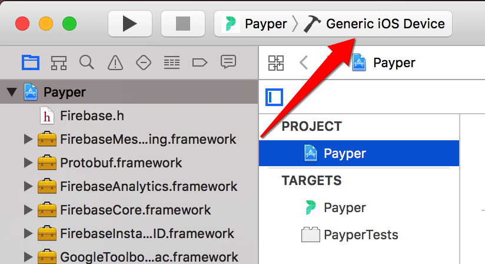

### 
# **Payper**
### Get paid for sharing your subscriptions.

## **Install**
```
$  git clone https://github.com/8BitRain/Payper.git
$  cd ~/path/to/repo
$  npm install
$  git push -u origin master
```

## **Run**
1. Open `/Payper/iOS/Coincast.xcworkspace` with Xcode.
2. Run `npm start` in the Payper root directory
3. In Xcode, navigate to `Product > Scheme > Edit Scheme` and ensure that the correct `Build Configuration` is selected under the Run/Info tab. The debug configuration will enable logs, the production configuration will not.
4. In Xcode, run the app (`⌘ + R`). If you run into issues, try cleaning the app then running it (`⌘ + shift + K`).
* If a non-existent node module error is thrown, run `npm install --save node-module-name`.

## **Contributing**
1. Create your branch: `git checkout -b branch-name`
2. Commit your changes: `git commit -am 'Change something`
3. Push to the branch: `git push origin branch-name`
4. Checkout master: `git checkout master`
5. Merge with branch: `git merge branch-name`
6. Resolve conflicts (if any)
7. Commit your changes `git commit -am 'Merge with branch-name'`
8. Push to master `git push origin master`

## **Data handling: Redux and Firebase**
Why do we use Redux? Long story short, Redux makes re-renders simple.
1. [Main](./scenes/Main/Main.js) invokes `startListeningToFirebase` function in [User](./classes/User.js) object.
2. Firebase listener in [User](./classes/User.js) detects a change in data.
3. Firebase data is reformatted by a [data handler](./helpers/dataHandlers) if need be.
4. Data is passed via callback to [Main](./scenes/Main/Main.js) which is [connected](https://github.com/reactjs/react-redux/blob/master/docs/api.md#connectmapstatetoprops-mapdispatchtoprops-mergeprops-options) to Redux.
5. `updateCurrentUser` Redux function is invoked from [Main](./scenes/Main/Main.js) component, triggering a re-render of any React components depending on user data.

## **Environment Variables**
In the root of the Payper repository you'll find a [config file](./config.json). We use this file to differentiate between development and production API keys and endpoints, like so:
```javascript
import config from 'path/to/config'
let env = config.env
let codePushKey = config[env].codePushKey
let lambdaBaseURL = config[env].lambdaBaseURL
let firebaseCredentials = config[env].firebaseCredentials
```
Firebase auth/database listeners, API calls, and CodePush synchronizations all depend on this config file.

## **App Updates: Standard Procedure**
There are two ways we can update the production version of Payper.

### Submit a new version to Apple for review
First, deploy the app to TestFlight through Xcode.
1. Select `Generic iOS Device` as your build's target device
#### 
2. Ensure that the version number and build number are correct; version number should be 0.0.1 higher than the last App Store release, build number should be 1 higher than the last TestFlight build (check [iTunes Connect](https://itunesconnect.apple.com/) for version history)
3. Run `Product > Clean` (`⌘ + shift + K`)
4. Run `Product > Archive`
5. When the Organizer window pops up your new archive will be selected
  * Click `Upload to App Store`
  * Select `Payper Inc.` as your Development Team and click `Choose`
  * Click `Upload`
6. Go to [iTunes Connect](https://itunesconnect.apple.com/) and navigate to the `Activity` tab; your build will say `(Processing)` next to it, wait for processing to complete (must refresh browser to see updates) and, when it does, navigate to `TestFlight` tab
7. There will be a yellow triangle next to your new TestFlight build with the message `Missing Compliance`; click this, click `Provide Export Compliance Information,` select no, then click `Start Internal Testing`
8. Download the new version from the TestFlight app and make sure everything is working as expected; if there are bugs, fix them and follow steps 1-8 again
Next, submit the TestFlight version for review with Apple.


### Deploy a CodePush update
CodePush allows us to update the app on user's devices without going through Apple. Every time the app launches it checks CodePush's servers for any updates; if an update is available, it installs it and relaunches the app immediately.

This method should be used for urgent updates, such as bug fixes, or for important and time-sensitive features additions.


#
